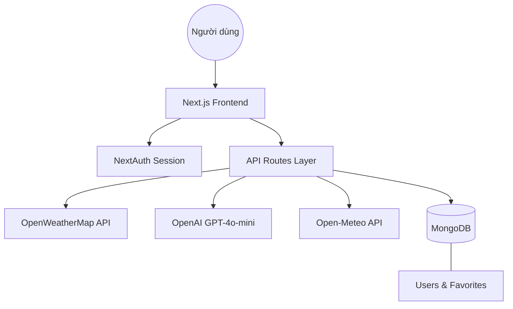

# BÁO CÁO DỰ ÁN Giữa KỲ

**Họ và tên:** Phạm Phước Bình  
**Mssv:** 1721031063  

---

# 🌤️ SKYCAST AI — Báo Cáo Tổng Hợp

> **Chuyên đề:** Phát triển Phần mềm  
> **Sản phẩm:** Ứng dụng Thời tiết Thông minh tích hợp AI  
> **Phiên bản:** 3.1 Full-Stack  
> **Cập nhật:** 02/04/2026  
> **GitHub:** [https://github.com/1721031063-PPB/DoAnGiuaKy](https://github.com/1721031063-PPB/DoAnGiuaKy)  
> **Video Demo:** [https://youtu.be/V6vfWKGXHR0](https://youtu.be/V6vfWKGXHR0)  

---

## 1. Tổng Quan Sản Phẩm

**SKYCAST AI** là ứng dụng web thời tiết thế hệ mới, kết hợp dữ liệu thời tiết thực từ API toàn cầu với trí tuệ nhân tạo (GPT-4o-mini) để cung cấp trải nghiệm thời tiết cá nhân hóa, thông minh và toàn bộ bằng tiếng Việt.

### Chỉ số dự án:
- **19** Tính năng hoàn thành
- **11** API Routes server-side
- **50+** Mô tả thời tiết đã Việt hóa
- **5** Trang độc lập (Dashboard, Favorites, Compare, Widget, Auth)
- **3** Nguồn API bên ngoài chính

---

## 2. Vấn Đề & Giải Pháp

| ❌ Vấn đề hiện tại | ✅ Giải pháp SKYCAST AI |
| :--- | :--- |
| Số liệu khô khan, khó hiểu | AI tóm tắt 80 từ thân thiện tiếng Việt |
| Không gợi ý hành động thực tế | AI Cố Vấn: trang phục + giờ vàng xuất phát |
| Không có tính năng lưu trữ | MongoDB lưu Favorites theo tài khoản |
| Giao diện tiếng Anh | 100% Việt hóa & dịch tự động API |
| Thiếu thông tin sức khỏe | Tích hợp AQI, UV, Phấn hoa & Cảnh báo |

---

## 3. Stack Công Nghệ

| Thư viện | Phiên bản | Vai trò |
| :--- | :--- | :--- |
| **Next.js** | 16.1.7 | Framework Full-Stack (App Router) |
| **React** | 19.2.4 | UI Library |
| **TypeScript** | 5.7 | Type safety |
| **Tailwind CSS** | 3.4.4 | Styling (Glassmorphism) |
| **Framer Motion** | 11.0 | Animation & Hiệu ứng khí hậu |
| **MongoDB** | 9.3 | Database (Mongoose) |
| **NextAuth** | 4.24 | Authentication (JWT + Credentials) |
| **bcryptjs** | 3.0 | Bảo mật mật khẩu |
| **Recharts** | 3.8 | Biểu đồ dữ liệu |
| **Leaflet** | 1.9 | Bản đồ tương tác |
| **OpenAI SDK** | 4.77 | Trí tuệ nhân tạo (GPT-4o-mini) |

---

## 4. Kiến Trúc Hệ Thống

### Phân Tách Cấu Trúc (Next.js Monolithic)
Để giữ sự đồng nhất trong kiến trúc (ngăn chặn lỗi module import), hệ thống sử dụng các thư mục quy ước sẵn của Next.js:

**🖥️ FRONTEND (Giao diện Client-Side)**
- `src/app/components/`: Chứa các khối giao diện như *Biểu đồ*, *Bản đồ đa lớp*, *Widget*.
- `src/app/favorites/`: Chứa trang giao diện trực quan trực tiếp quản lý các địa điểm yêu thích đã lưu.
- `src/app/*/(page.tsx)`: Các trang người dùng nhìn thấy (*Tra cứu*, *So sánh*, *Đăng nhập*).
- `public/`: Tệp tĩnh hình ảnh và Service Worker nhận thông báo cảnh báo.

**⚙️ BACKEND (Logic xử lý & Server-Side)**
- `src/app/api/`: Trái tim Backend, chứa tất cả các Controller Endpoint để giao tiếp với Client, AI, DB.
- `src/app/lib/`: Các hàm kết nối với MongoDB, giải thuật tự động sinh ngôn từ Fallback nội bộ.
- `src/app/models/`: Cấu trúc (Schema) định nghĩa đối tượng CSDL lưu trong MongoDB.

---

## 5. Mô Tả Chi Tiết Các Tính Năng

### 5.1 — Tra cứu thời tiết & Dự báo
Sử dụng **OpenWeatherMap API** để lấy dữ liệu thời tiết thực. Kết quả được dịch tự động sang tiếng Việt thông qua bảng ánh xạ 50+ cụm từ được tích hợp sẵn.

### 5.2 — Tóm tắt AI tiếng Việt
Sử dụng **GPT-4o-mini** để tạo đoạn tóm tắt thời tiết tự nhiên. Có cơ chế **Fallback nội bộ** tự sinh câu khi API lỗi, đảm bảo tính ổn định cao.

### 5.3 — AI Cố Vấn Chuyến Đi (JSON Mode)
Phân tích kế hoạch người dùng để trả về: Điểm số an toàn, trang phục đề xuất, giờ vàng xuất phát và lời khuyên cụ thể.

### 5.4 — Hệ thống Tài khoản & Yêu thích
Đăng ký/Đăng nhập bằng mã hóa bcrypt. Lưu trữ địa điểm yêu thích vào MongoDB theo từng tài khoản người dùng cá nhân.

### 5.5 — Lịch sử 30 ngày & Biểu đồ
Sử dụng API **Open-Meteo** miễn phí để hiển thị diễn biến thời tiết trong quá khứ qua biểu đồ Area và Bar Chart.

### 5.6 — Bản đồ đa lớp (6 lớp dữ liệu)
Bản đồ tương tác cho phép chọn: Radar mưa, Nhiệt độ, Tốc độ gió, Mây, Áp suất và Lượng mưa.

---

## 6. Quy Trình Phát Triển (Timeline)

1.  **Giai đoạn 1 — UI/UX & Core:** Cài đặt Next.js, thiết kế Glassmorphism, tích hợp API thời tiết cơ bản.
2.  **Giai đoạn 2 — Backend & Auth:** Thiết lập MongoDB, Mongoose và hệ thống NextAuth bảo mật.
3.  **Giai đoạn 3 — Data & Localization:** Xây dựng biểu đồ Recharts, API Favorites và Việt hóa 100%.
4.  **Giai đoạn 4 — AI & Reliability:** Triển khai GPT JSON Mode và hệ thống Fallback an toàn.
5.  **Giai đoạn 5 — Advanced Features:** Push Notification, Lịch sử 30 ngày, So sánh thành phố và Widget.

---

## 7. Kết Quả Đạt Được

- [x] Tra cứu thời tiết toàn cầu & Autocomplete địa danh.
- [x] Tóm tắt AI & Cố vấn du lịch thông minh (có Fallback).
- [x] Bản đồ 6 lớp dữ liệu thời tiết trực tiếp.
- [x] Hệ thống tài khoản người dùng & Lưu yêu thích (MongoDB).
- [x] Push Notification cảnh báo thiên tai (Service Worker).
- [x] Trang Quản lý Yêu thích chuyên biệt, So sánh thành phố & Widget nhúng iframe.

> **Tổng kết:** Đạt **19/19** tính năng mục tiêu. Ứng dụng có tính ổn định cao, thiết kế hiện đại và trải nghiệm người dùng mượt mà.

---

## 8. Hướng Dẫn Cài Đặt & Chạy

1.  **Cài đặt:** `npm install`
2.  **Cấu hình:** Tạo `.env.local` với các key: `OPENWEATHER_API_KEY`, `MONGODB_URI`, `NEXTAUTH_SECRET`.
3.  **Khởi chạy:** `npm run dev`
4.  **Truy cập:** `http://localhost:3000`

---
**SKYCAST AI — Báo Cáo Dự Án v3.1**  
*Phạm Phước Bình — 1721031063*
